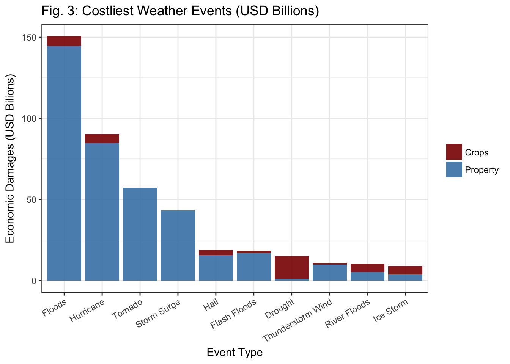

[**CLICK HERE**](https://reyvaz.github.io/NOAA-Database-Analysis/us_weather.html)
to see full report in html

## Exploring the US NOAA Storm Database

This repository contains the R scripts to explore the U.S. National Oceanic and 
Atmospheric Administration's (NOAA) storm database. The database tracks 
characteristics of major storms and weather events in the United States, 
including date and location, estimates of fatalities, injuries, and property 
damage. The records start in 1950 and end in November 2011. It contains 
nearly 1 million records.   

The data is available 
[here](https://d396qusza40orc.cloudfront.net/repdata%2Fdata%2FStormData.csv.bz2). 
It was downloded for this analysis on September 7, 2017. 

The analysis addresses two questions:

1. In the U.S., what weather events have been the most harmful to population 
life and health?  
2. In the U.S., what weather events have been the most economically devastating?  

Tornadoes are found to have caused the most fatalities and injuries in the 
period reported. The second most hazardous to human life and health, as well as
the most economically devastating, are floods. 

* The rendered html version of the analysis can be found [here](https://reyvaz.github.io/NOAA-Database-Analysis/us_weather.html).   

* To recreate the entire report simply run [us_weather.Rmd](us_weather.Rmd) 
script with the database downloaded from the link above. 

[GitHub Pages Link](https://reyvaz.github.io/NOAA-Database-Analysis/)  
 

 